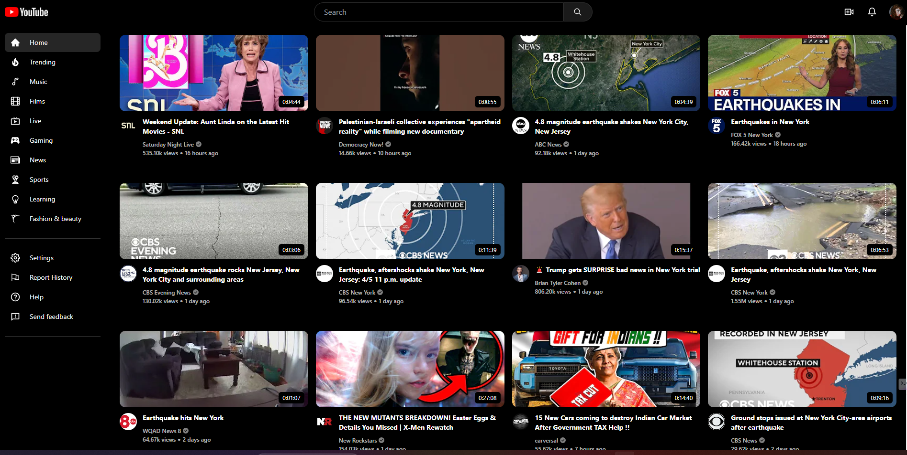

# YouTube-Mini

## Table of Contents

- [Movie-Base](#movie-base)
  - [Table of Contents](#table-of-contents)
  - [About the Project](#about-the-project)
  - [Features](#features)
  - [Installation](#installation)
  - [Technologies Used](#technologies-Used)
  - [Future Development](#future-Development)

## About the Project

YouTube Mini offers a focused YouTube experience, prioritizing discoverability with a streamlined layout, intuitive navigation, and optimized video playback for enjoyable viewing.

## Features

- Search Functionality:
- Quickly find movies by title or keyword.
- User-Friendly Filtering: Narrow down search results by genre, release date, rating, and more.
- Visually Appealing Design: An attractive layout emphasizes movie posters and key information for easy browsing.
- Responsive Interface: Adapts seamlessly across different screen sizes (desktop, tablet, mobile).
- REST API Integration: Fetches movie data dynamically for a smooth and up-to-date user experience.

## Installation

- Clone the repository: git clone https://github.com/abhijeetjohnkujur/Movie-base.git
- Navigate to the project directory: cd Movie-base
- Install dependencies: npm install
- Start the development server: npm start

## Technologies Used

- React.js
- Tailwind CSS
- TMDB API
- JavaScript

## Future Development

- Implement user authentication for saving favorite movies.
- Personalized Database

